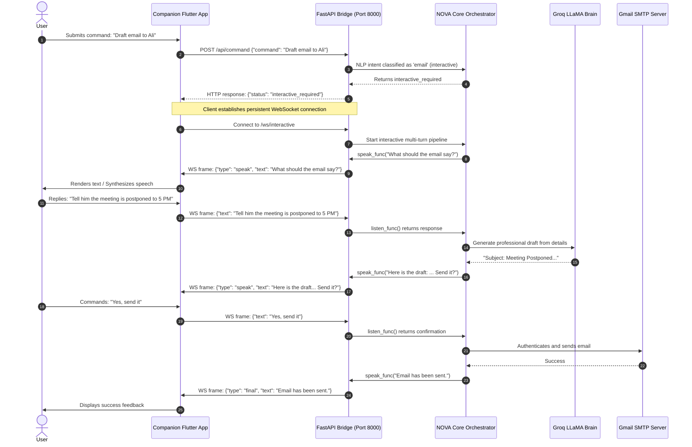
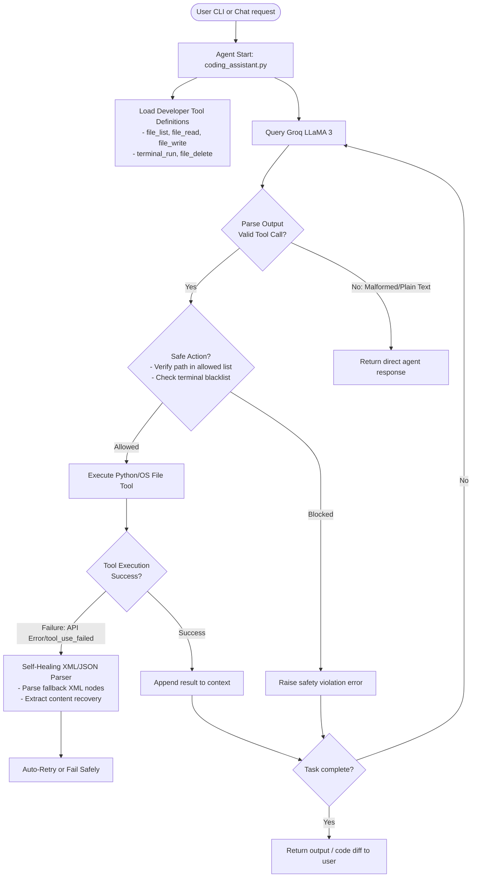
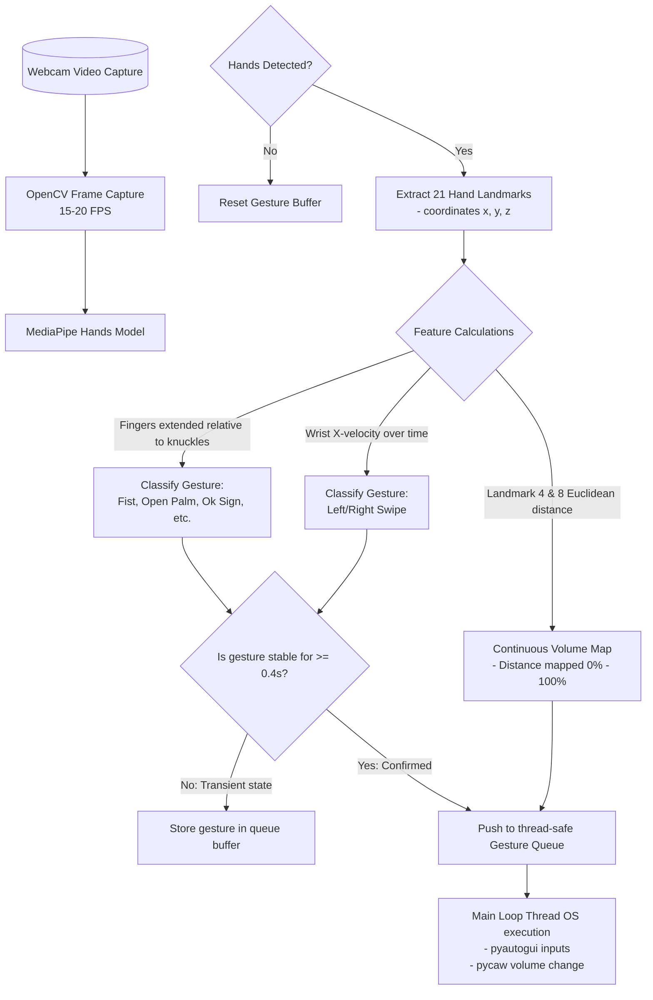
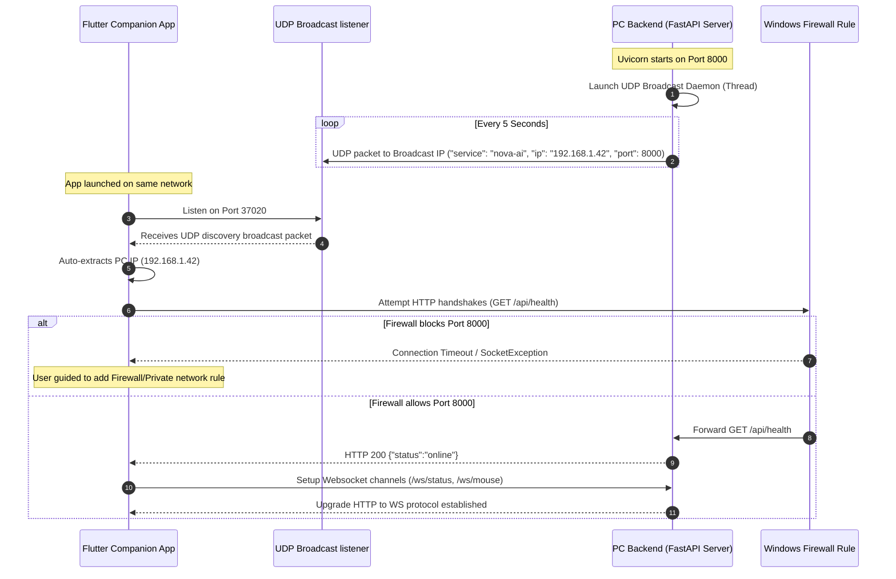
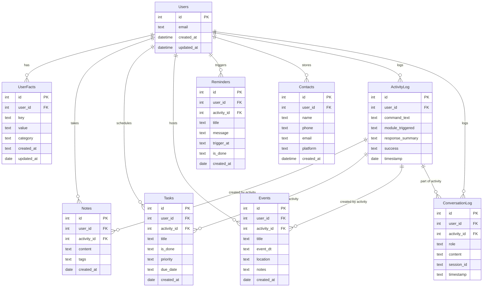

# NOVA AI 🤖

### Neural Orchestrated Voice Assistant with Autonomous Intelligence

> A production-style, local-first Python AI voice assistant and distributed cross-platform ecosystem. Featuring wake-word activation, offline/online Speech-to-Text, an NLP intent routing engine, Groq LLM brain, hand gesture control (OpenCV + MediaPipe), a cinematic pywebview HUD interface, and a FastAPI-driven WebSocket API bridge communicating with a Flutter companion app.

---

# 📖 Table of Contents
1. [✨ Features](#-features)
2. [📱 Companion App Access & Installation](#-companion-app-access--installation)
3. [🚀 Current Development Status](#-current-development-status)
4. [🏗️ System Architecture & Diagrams](#-system-architecture--diagrams)
   - [System Architecture](#system-architecture)
   - [NLP vs Groq Routing Logic](#nlp-vs-groq-routing-logic)
   - [Multi-turn WebSocket Interactive Sequence](#multi-turn-websocket-interactive-sequence)
   - [Database Entity-Relationship Diagram (ERD)](#database-entity-relationship-diagram-erd)
5. [🔌 FastAPI Bridge Server & API Contracts](#-fastapi-bridge-server--api-contracts)
6. [⚡ Quick Start](#-quick-start)
7. [🧪 Testing](#-testing)
8. [🎨 HUD UI System](#-hud-ui-system)
9. [✋ Gesture Controls](#-gesture-controls)
10. [🤝 Contributors & Contributions](#-contributors--contributions)
11. [⭐ Future Scope & License](#-future-scope--license)

---

# ✨ Features

NOVA AI is a modular desktop AI assistant and distributed mobile ecosystem designed to integrate:

*   🎤 **Voice Pipeline:** Hands-free passive listening for `"Hey NOVA"` wake word, fast online Speech-to-Text (STT) with Whisper local offline fallback, and high-quality Text-to-Speech (TTS).
*   🧠 **Dual-Brain Router (NLP & LLM):** Rules-based NLP engine (spaCy + NLTK) routes simple system/web commands locally with sub-10ms response times. Complex, conversational, or creative inputs escalate to the Groq API (LLaMA 3 70B) for instant reasoning.
*   📱 **Flutter Companion App:** Full-fledged remote client that acts as a second screen, showing real-time status, diagnostics, filesystem explorer, terminal runner, and remote trackpad.
*   🖥️ **Windows & Web Automation:** Command execution for desktop volume, brightness, processes, screenshots, SMTP emails, and WhatsApp messaging (via Selenium and PyWhatKit).
*   ✋ **Hand Gesture Control:** OpenCV and MediaPipe Hands tracking 21 landmarks on a webcam. Volume mapping based on pinch distance, tab swapping, scrolling, and playback controls.
*   🗃️ **Persistent SQLite Memory:** A multi-table memory engine (`memory.db`) storing user preferences, notes, tasks, events, and rolling conversation history. Facts are automatically extracted from conversations via Groq and injected into the LLM system prompt.
*   🎨 **Cinematic HUD Interface:** Frameless, right-docked dark overlay (`pywebview`) featuring a circular animated waveform, live clock, real-time logging, and system status markers.

---

# 📱 Companion App Access & Installation

NOVA comes with a cross-platform companion application built in Flutter. This companion app provides remote voice command inputs, a terminal console, system monitoring, file browsing, and mouse trackpad control.

### 1. Where to Find the App
All source code and build assets for the companion application reside inside the **`nova_app`** directory at the root of the project:
```
NOVA-AI/
└── nova_app/                  <-- Go here for the companion app!
```

### 2. How to Download the Pre-built App (Android APK)
If you want to install the companion app directly on your Android phone without setting up a Flutter development environment, you can use the pre-compiled release package:
*   **Direct Path on PC:** `nova_app/build/app/outputs/flutter-apk/app-release.apk`
*   **How to Install:** 
    1. Connect your Android device to your computer via USB (or send the file via local sharing/email).
    2. Copy `app-release.apk` to your phone's storage.
    3. Open the file manager on your phone, tap the APK file, and install it. *(Note: You may need to allow installations from "Unknown Sources" in your Android settings).*

### 3. How to Run from Source Code (Web / Mobile / Desktop)
If you wish to run or compile the app yourself, make sure you have the **Flutter SDK** installed and run:
```bash
# Navigate to the app folder
cd nova_app

# Fetch dependencies
flutter pub get

# Run on a connected Android/iOS device or desktop
flutter run

# Run on Chrome (for quick browser testing)
flutter run -d chrome

# Build a fresh release APK
flutter build apk --release
```

### 4. Companion App Functionality & Internal Modules
The Flutter companion app is structured as a modular controller dashboard containing the following sub-modules:

*   📊 **Real-time Diagnostics Tab (`lib/screens/home/dashboard_tab.dart`):** Fetches and visualizes CPU load, RAM usage, storage details, battery stats, and server uptime. Syncs search queries immediately from Chrome shortcuts.
*   🎛 **Remote status Sync Panel:** Bridges to `/ws/status` WebSocket to show real-time states (`listening`, `processing`, `speaking`, `sleeping`) via a pulsing visual orbital icon.
*   🖱 **Mouse Trackpad Module (`lib/screens/home/trackpad_tab.dart`):** A low-latency canvas connecting to the `/ws/mouse` channel. Translates device touch drags, taps, double-taps, and scroll scrolls directly to Windows cursor actions on your PC.
*   📁 **Secure Filesystem Manager (`lib/screens/home/files_tab.dart`):** Browses and lists allowed directory trees (`Desktop`, `Documents`, `Downloads`, `CWD`). Provides instant (<0.05s) search queries using Windows Search Indexer, text file reading/writing, subfolder creation, deletion, and remote file executions.
*   💻 **Terminal Console Runner (`lib/screens/home/terminal_tab.dart`):** Runs CLI command prompts on your PC backend remotely. Safety rules are hardcoded on the PC to block dangerous actions.
*   🧠 **Agentic Dev Chat Screen (`lib/screens/home/chat_tab.dart`):** Integrates with the backend autonomous Dev agent (`coding_assistant.py`) to let users chat, write code, run script iterations, and manage project files from their mobile client.
*   📋 **Clipboard Synchronization (`lib/screens/home/clipboard_tab.dart`):** Features dual-copy pipelines that sync the PC clipboard buffer to the mobile phone and vice versa.
*   ⚙ **First-run Onboarding Wizard (`lib/screens/setup/onboarding_screen.dart`):** Provides a visual config flow allowing users to initialize Groq credentials, email settings, and local contacts.

---

# 🚀 Current Development Status

## ✅ Week 1 — Foundation & Core Voice Pipeline
*   Wake Word Detection (pvporcupine / Energy Threshold scanner)
*   Speech-to-Text (SpeechRecognition + Google Speech Web API)
*   NLP Intent Router (NLTK + spaCy entity extraction)
*   Groq LLM Brain (Fast LLaMA inference)
*   SQLite Memory System & Core Database
*   Cinematic HUD & Waveform Canvas
*   End-to-End Voice pipeline loop integration

## ✅ Week 2 — Information & Automation
*   Weather Module (OpenWeatherMap API integration)
*   Science & NASA News (APOD NASA API)
*   Wikipedia Search Integration
*   Language Translation (deep-translator backend)
*   Web Automation (Selenium site interaction)
*   Application Launcher (Fuzzy matching app registry)
*   Clipboard Manager (pyperclip reading/writing)
*   Email Compose & Send Workflow (smtplib SMTP)
*   WhatsApp Automation (PyWhatKit Web browser automation)
*   Music & Media Playback Controls (VLC / YouTube autoplay)

## ✅ Week 3 — Productivity, Gestures & System
*   Notes & Timed Reminders System (Daemon polling thread)
*   Calendar & Task Manager (SQLite backed scheduler)
*   System Controls (Audio level control, brightness, CPU/RAM stats)
*   Screenshot Tools (Desktop capture utility)
*   Gesture Engine (OpenCV + MediaPipe Hands daemon thread)
*   Activity Logging System (`activity_log.db` audit logging)
*   Plugin & Configuration Manager (JSON hot-reload parser)
*   Personality & Chit-Chat System (Custom system prompts + offline jokes)

## ✅ Week 4 — Local-First Distributed System Complete
*   FastAPI Bridge Server implementation
*   Real-Time WebSocket bridges for status, mouse, and interactive flows
*   Cross-Platform Flutter Companion App
*   Windows Indexer-based instant desktop file search
*   Secure remote file explorer and terminal runner
*   Onboarding credentials configuration wizard
*   Autonomous Coding Assistant console agent

---

# 🏗️ System Architecture & Diagrams

### 1. Complete System Module Interaction Map
The following diagram showcases how each individual module (M1 to M25) fits together, highlighting their communication interfaces with the Orchestration Core, the user interfaces, and the database/config storage zones.

```mermaid
flowchart TB
    subgraph UI ["User Interfaces"]
        Companion["Flutter App (nova_app)\n- Status Dashboard\n- File Browser\n- Diagnostics\n- Trackpad\n- Terminal\n- Chat Screen"]
        HUD["pywebview HUD\n- Webview Engine\n- HTML/JS Waveform\n- Logs Ticker"]
    end

    subgraph Core ["Orchestration Core"]
        Main["main.py\n- Multithread Manager\n- Pipeline Coordinator\n- TTS Runner"]
        NC["nova_core.py\n- local_dispatch()\n- NLP/Groq Routing\n- State Manager"]
        API["api_server.py\n- FastAPI REST API\n- WebSocket Streams\n- UDP Discovery"]
    end

    subgraph Inputs ["Input Capture Engines"]
        M1["M1: Wake Word\n(pvporcupine)"]
        M2["M2: Speech-to-Text\n(Whisper / Google)"]
        M3["M3: NLP Intent Engine\n(spaCy / NLTK)"]
        M22["M22: Gesture Control\n(OpenCV + MediaPipe)"]
    end

    subgraph Brains ["Reasoning Engines"]
        M4["M4: Groq LLM Brain\n(LLaMA 3 70B)"]
        M21["M21: Personality\n(pyjokes / prompts)"]
    end

    subgraph LocalModules ["Local Feature Modules"]
        subgraph Info ["Information Modules"]
            M5["M5: Weather\n(OpenWeatherMap)"]
            M6["M6: Science News\n(NASA APOD)"]
            M7["M7: Wikipedia\n(Quick summaries)"]
            M15["M15: DateTime/Math\n(Calculations)"]
            M19["M19: Translation\n(deep-translator)"]
        end

        subgraph Auto ["Automation Modules"]
            M8["M8: Web Automation\n(Selenium)"]
            M9["M9: App Launcher\n(fuzzy matching)"]
            M10["M10: Email Sending\n(smtplib SMTP)"]
            M11["M11: WhatsApp Msg\n(PyWhatKit)"]
            M12["M12: Music & Media\n(VLC / YT Play)"]
            M16["M16: System Controls\n(pycaw / brightness)"]
            M17["M17: Screenshot\n(pyautogui)"]
            M18["M18: Clipboard Mgr\n(pyperclip)"]
        end

        subgraph Prod ["Productivity Modules"]
            M13["M13: Notes & Reminders\n(polling alerts)"]
            M14["M14: Calendar & Tasks\n(schedulers)"]
        end
    end

    subgraph Storage ["State & Persistence"]
        M20["M20: Memory System\n(Fact extraction)"]
        M24["M24: Activity Logger\n(Audit logging)"]
        M25["M25: Config Manager\n(config.json reload)"]
        DB[("SQLite Databases\n- memory.db\n- activity_log.db")]
    end

    %% Wiring it all up
    Companion <-->|FastAPI REST & WebSockets| API
    HUD <-->|evaluate_js() / events| Main
    API <-->|Thread-safe calls| NC
    Main <-->|Coordinates| NC

    M1 -->|Fires Wake event| Main
    Main --> M2 --> M3
    M3 -->|Routes to local modules| LocalModules
    M3 -->|Escalates to Groq| M4
    M22 -->|Thread-safe queue| OS_Control[Windows OS Control]

    M4 --> M20
    M20 --> DB
    M24 --> DB
    M25 --> DB
    LocalModules --> DB
    
    Info --> NC
    Auto --> NC
    Prod --> DB
```

---

### 2. High-Level System Architecture (Hardware & Network Topology)
The system diagram below shows the hardware-level runtime connections between the multi-threaded Python core backend on your PC, the pywebview HUD, and the Flutter companion app communicating over the local network via FastAPI.

```mermaid
flowchart TB
    %% Nodes
    subgraph Client["Frontend Interfaces"]
        HUD["pywebview HUD\n(HTML/CSS/JS Overlay)"]
        Flutter["Flutter Companion App\n(Mobile/Web/Desktop)"]
    end

    subgraph Backend["Python 3.11 Backend (Concurrent Threads)"]
        MainThread["Main Thread\n(Orchestration & Event Loop)"]
        WakeThread["Wake Word Thread\n(pvporcupine / Energy Threshold)"]
        VoiceThread["Voice Pipeline Thread\n(Speech-to-Text / Intent Routing)"]
        GestureThread["Gesture Engine Thread\n(OpenCV + MediaPipe Hands)"]
        ReminderThread["Reminder Engine Thread\n(SQLite Poll Daemon)"]
        FastAPI["FastAPI Bridge Server\n(Uvicorn Daemon Thread)"]
    end

    subgraph Data["Storage Layer"]
        DB["SQLite: memory.db\n(User facts, Notes, Tasks, Reminders)"]
        LogDB["SQLite: activity_log.db\n(Command log history)"]
        Config["JSON Config Registry\n(config.json, apps.json, sites.json)"]
    end

    subgraph Targets["Target Action Services"]
        OS["Windows OS Control\n(pycaw, pyautogui, psutil)"]
        Selenium["Web Automation\n(Selenium WebDriver)"]
        APIs["Web APIs\n(OpenWeatherMap, NASA APOD, Wikipedia)"]
        LLM["Groq Cloud LLM\n(LLaMA 3 70B Brain)"]
    end

    %% Connections
    WakeThread -->|Signals Wake Event| MainThread
    GestureThread -->|Thread-safe OS Actions| OS
    ReminderThread -->|Queries Reminders| DB
    ReminderThread -->|Pushes alerts to Ticker| HUD
    
    FastAPI <-->|WebSockets (Status, Interactive, Mouse)\nHTTP REST APIs (Files, Chat, SysInfo)| Flutter
    MainThread <-->|evaluate_js() / JS Bridge| HUD
    
    VoiceThread -->|Queries & Updates| DB
    VoiceThread -->|Reads/Writes| Config
    VoiceThread -->|Writes Logs| LogDB
    
    VoiceThread -->|Escalates query| LLM
    VoiceThread -->|Dispatches local actions| OS
    VoiceThread -->|Launches web commands| Selenium
    VoiceThread -->|Fetches data| APIs
    
    FastAPI -->|Executes commands| VoiceThread
    FastAPI -->|Direct DB Queries| DB
    FastAPI -->|Direct Disk / Terminal Ops| OS
```

---

### 3. NLP vs Groq Routing Logic
A dual-brain layout that ensures local, offline execution for deterministic intents and only calls the cloud LLM when conversational reasoning is required.

```mermaid
flowchart TD
    Input([User Input: Voice or Companion Text]) --> STT[Speech-to-Text conversion]
    STT --> NLP[NLP Intent Engine]
    NLP --> NER[spaCy NER: Extract Entities\n(Apps, Cities, Contacts, Dates)]
    NER --> Stopwords[NLTK Tokenization & Stopwords Clean]
    Stopwords --> Match{Rule-Based Keyword Match\nConfidence >= 0.75?}
    
    Match -->|Yes & Local Intent| Local[Local Module Router\n(System, Web Open, Translation, Weather)]
    Match -->|No / Low Confidence / Complex Query| Groq[Groq LLM LLaMA 3 70B Brain]
    
    Local --> Exec[Execute Action & Generate Response]
    Groq --> Context[Inject Top 10 SQLite User Facts]
    Context --> GroqAPI[Call Groq API]
    GroqAPI --> Extract[Groq Auto-Extracts New User Facts]
    Extract --> SaveMemory[Save New Facts to SQLite]
    GroqAPI --> Exec
    
    Exec --> TTS[TTS Speech Output\n(pyttsx3 / gTTS)]
    Exec --> UI[Update HUD Logs & Companion App Status]
    Exec --> DBLog[Write to SQLite Activity Log]
```

---

### 4. Multi-turn WebSocket Interactive Sequence
This sequence outlines the multi-turn session bridge used when complex voice procedures (like drafting and reviewing emails or setting up WhatsApp alerts) are performed via the WebSocket channel.



---

### 5. Autonomous Coding Agent (Dev Module) Execution & Self-Healing Loop
This diagram traces the agentic loop inside `modules/coding_assistant.py`. The agent can write, read, and delete code files, execute terminal scripts, verify safety constraints, and apply a self-healing regex/XML parser to automatically recover from malformed Groq API output structures.



---

### 6. MediaPipe Hand Gesture Recognition & Debounce Pipeline
How hand frames captured from the local webcam are converted into relative joint coordinates, processed to classify specific gesture patterns, and debounced to prevent accidental firing.



---

### 7. Local Subnet Auto-Discovery & Connection Lifecycle
How the host PC and remote companion app locate each other automatically over a local Wi-Fi connection and establish secure REST/WebSocket handshake tunnels.



---

### 8. Database Entity-Relationship Diagram (ERD)
Persistent state storage mapped inside `data/memory.db` and audit trails in `data/activity_log.db`.



---

# 🔌 FastAPI Bridge Server & API Contracts

The Python backend starts an API bridge running locally via FastAPI to host remote interactions. Below is a comprehensive list of endpoints available to client applications.

### 1. REST Endpoints (HTTP JSON)

| Endpoint | Method | Auth Required | Description |
| :--- | :--- | :--- | :--- |
| `/api/health` | GET | No | Returns API status (`online`). |
| `/api/setup/status` | GET | No | Returns configuration state (tells client if Groq API keys are set up). |
| `/api/setup` | POST | Yes | Configures user names, OpenAI/Groq keys, weather defaults, and saves to `.env`. |
| `/api/command` | POST | Yes | Executes text command on PC through NLP pipeline. |
| `/api/system/info` | GET | Yes | Returns PC hardware diagnostics (CPU%, RAM%, Disk%, Network, Battery, Uptime). |
| `/api/chat/code` | POST | Yes | Initiates session with autonomous Dev coding assistant agent. |
| `/api/chat/code/reset`| POST | Yes | Resets the coding assistant's conversation context. |
| `/api/files/list` | GET | Yes | Lists files/folders in allowed user root paths (Desktop, Documents, Downloads, CWD). |
| `/api/files/search` | GET | Yes | Performs rapid (<0.05s) Windows search indexing or manual tree traversal. |
| `/api/files/read` | GET | Yes | Opens and reads a text-based file from the allowed directories. |
| `/api/files/write` | POST | Yes | Writes contents to a target text file. |
| `/api/files/mkdir` | POST | Yes | Creates a new subfolder in the safe system root paths. |
| `/api/files/delete` | DELETE | Yes | Deletes a specified file or directory. |
| `/api/files/open` | GET | Yes | Launches a target PC file with its default Windows application. |
| `/api/terminal/run` | POST | Yes | Spawns a shell subprocess and executes CLI commands on the host machine. |
| `/api/screenshot/latest`| GET | Yes | Feeds the most recently taken screenshot as a PNG file response. |
| `/api/clipboard` | GET | Yes | Reads the current Windows OS clipboard buffer. |
| `/api/clipboard` | POST | Yes | Sets target content directly into the Windows clipboard buffer. |
| `/api/activity` | GET | Yes | Pulls command history logs. |
| `/api/notes` | GET/POST | Yes | Adds or retrieves saved notes from SQLite database. |
| `/api/tasks` | GET/POST | Yes | Configures and reads user to-do tasks. |

### 2. WebSocket Protocols (Low-Latency Streams)

*   **`/ws/status`**: Streams real-time state changes of the voice assistant (`sleeping`, `listening`, `processing`, `speaking`) to synchronize UI indicators on client dashboards.
*   **`/ws/interactive`**: Used to establish two-way streams for complex tasks where NOVA requests voice clarification (e.g. asking for mail subject, body details, or correction instructions).
*   **`/ws/mouse`**: Direct input stream mapping coordinates for remote mouse movements, clicks, and scroll gestures.

### 3. UDP Auto-Discovery Broadcast
Starts a background broadcaster on socket port `37020` to stream local server parameters. This enables the Flutter app on the same local network subnet to automatically discover the host IP and connect without requiring manual entry.

---

# ⚡ Quick Start

### 1. Clone Repository
```bash
git clone https://github.com/AkifNaveed12/NOVA-AI.git
cd NOVA-AI
```

### 2. Create Virtual Environment
```bash
python -m venv venv
venv\Scripts\activate
```

### 3. Install Backend Dependencies
Ensure you have Python 3.11 installed, then run:
```bash
pip install -r requirements.txt
python -m spacy download en_core_web_sm
```

### 4. Configure Environment Variables
Copy the template and fill in your keys:
```bash
copy .env.example .env
```
Open `.env` in your editor and input the details:
```env
GROQ_API_KEY=gsk_your_key_here
OPENWEATHER_API_KEY=your_openweather_key
NASA_API_KEY=DEMO_KEY
GMAIL_ADDRESS=your_email@gmail.com
GMAIL_APP_PASSWORD=your_gmail_app_password
NOVA_API_SECRET=nova-secret-change-this
```

### 5. Run NOVA AI Backend
```bash
python main.py
```

### 6. Connect the Companion App
1. Ensure your smartphone/tablet/web browser is on the **same Wi-Fi network** as the PC hosting the NOVA server.
2. Launch the Flutter app inside `nova_app/` (either via compiling it using the instructions in the [App Guide](#-companion-app-access--installation) or running the pre-built `app-release.apk`).
3. Connect utilizing your PC's local network IP and the `NOVA_API_SECRET` you set in the `.env` file.

---

### 📶 Connection Troubleshooting

If the Flutter companion app is unable to connect to the PC server and outputs a connection failure error, follow these troubleshooting rules:

#### A. Set Windows Network Profile to "Private"
Windows blocks incoming local connections if your Wi-Fi interface profile is set to **Public**.
*   **PowerShell (Run as Administrator):**
    ```powershell
    Set-NetConnectionProfile -Name "YOUR_WIFI_NAME" -NetworkCategory Private
    ```
    *(Replace `YOUR_WIFI_NAME` with the active Wi-Fi name connection)*
*   **GUI Alternative:** Go to **Windows Settings** ➔ **Network & Internet** ➔ **Wi-Fi** ➔ Select active network ➔ Toggle network profile type to **Private**.

#### B. Create Windows Firewall Rule for Port 8000
You must explicitly allow traffic on port `8000` (FastAPI bridge):
1. Open **PowerShell (Run as Administrator)**.
2. Execute the rule:
    ```powershell
    New-NetFirewallRule -DisplayName "NOVA AI API Port 8000" -Direction Inbound -LocalPort 8000 -Protocol TCP -Action Allow
    ```

#### C. Ensure Router AP Isolation is Disabled
Verify that your home Wi-Fi router doesn't have **AP Isolation** (Client Isolation) enabled, which blocks devices on the same wireless network from communicating with one another.

---

# 🧪 Testing

Run tests to validate the engine configurations, intents, database structures, and threading state:
```bash
pytest tests/test_all.py -v
```

---

# 🎨 HUD UI System

NOVA features an on-screen overlay HUD utilizing `pywebview`, presenting a sci-fi cockpit theme:
*   **Animated Waveform:** Responsive circles showing distinct animations for state cycles (pulsing slower in idle, dynamic random peaks in listening, and audio-synced heights during speaking).
*   **Transparent Overlay:** Edge-to-edge docking frame fixed on the right side of the desktop monitor using `#0D0D0D` dark styling at `0.92` transparency.
*   **Interactive Header:** Tapping on the center logo/waveform zone manually fires the voice listener.

---

# ✋ Gesture Controls

 Vision controls running as a background OpenCV thread using 21-landmark tracking:

| Gesture | Coordinate Mapping / Detection | Output OS Command |
| :--- | :--- | :--- |
| **Open Palm** | 5 extended fingertips above knuckles | Play / Resume media |
| **Fist** | Curled closed fingers | Pause media playback |
| **Pinch** | Landmark 4 (thumb) & 8 (index) distance < 30px | Linear Windows master volume adjust |
| **OK Sign** | Thumb and index forming loop, other fingers straight | Switch to next browser tab |
| **Index Up** | Only index extended | Volume up (+5% step) |
| **Index & Middle**| Index and middle extended | Scroll page up |
| **Three Fingers** | Index, middle, and ring extended | Scroll page down |
| **Left Swipe** | Fast negative X-axis wrist velocity | Previous media track |
| **Right Swipe** | Fast positive X-axis wrist velocity | Next media track |

---

# 🤝 Contributors & Contributions

## 👨‍💻 Muhammad Akif Naveed (Lead Developer)
BS Software Engineering, COMSATS University Islamabad — Wah Campus

*Designed and implemented the core foundations of NOVA AI, including the multi-threaded wake-word engine, NLP intent routing, pywebview cinematic HUD, and modular local execution pipelines.*

---

## 👨‍🚀 Muhammad Alyan ([@Alyan-khattak](https://github.com/Alyan-khattak))
GitHub: [Alyan-khattak](https://github.com/Alyan-khattak)

*Pioneered the transition of NOVA AI from a standalone desktop software into a distributed, local-first cross-platform ecosystem by executing the specifications in `EXPANSION_PLAN.md` and `FEATURES_PLAN.md`.*

### Key Features Developed (Desktop-to-App & API Bridge):
*   **FastAPI Bridge Server:** Designed the backend API framework (`modules/api_server.py`) executing safe multithreaded command routing utilizing a `threading.Lock` around `nova_core.route()`.
*   **Real-Time WebSocket Status Bridge:** Created `/ws/status` and `/ws/interactive` WebSocket protocols enabling real-time status syncing and fluid multi-turn voice/text flows.
*   **Cross-Platform Flutter Companion App:** Engineered the mobile/web Flutter application (`nova_app`) featuring setup wizards, real-time status dashboards, remote voice/text command shell, and terminal interface.
*   **PC File Browser API & Interface:** Created the endpoints and Flutter interface allowing users to securely browse, list, read, and open PC files remotely.
*   **UDP Auto-Discovery Broadcaster:** Developed a local network UDP broadcaster permitting companion devices to discover the PC server automatically.
*   **Onboarding Setup Wizard:** Designed a secure on-device configuration flow validating Groq/API credentials on the first run.
*   **Agentic Coding Assistant:** Upgraded the Dev module (`modules/coding_assistant.py`) into an autonomous terminal agent with local filesystem tools (list, read, write, delete) and console command execution.
*   **Self-Healing API Fallback Parser:** Engineered an XML-to-JSON fallback extraction algorithm to intercept and recover from Groq API `tool_use_failed` errors during code writing tasks.
*   **System Diagnostics & Clipboard Sync:** Built real-time PC diagnostic metrics (CPU, RAM, Disk, Network) and two-way clipboard synchronization.
*   **Google & YouTube Search Shortcuts:** Added dashboard search integration shortcuts to execute immediate web automations and searches on the PC browser from the mobile client.
*   **Remote Mouse Trackpad Control:** Developed a low-latency `/ws/mouse` WebSocket pipeline and custom gesture/scroll tracking panel inside the Flutter app.
*   **Instant Windows Index Search:** Leveraged the native Windows Collator Search database to provide instant desktop file searches (<0.05s) across secure user directories.
*   **Pulsing Sci-Fi Launcher Icon:** Designed a custom orbital breathing geometry icon matching the system HUD and packaged it into Android mipmap assets.

---

# ⭐ Future Scope & License

*   **Offline LLMs:** Add support for running local models (e.g. LLaMA/Ollama) to ensure complete data privacy and offline query resolution.
*   **Voice Customization:** Integrate voice cloning (using models like Coqui TTS or Bark) to deliver a personalized synthesis profile.
*   **Smart Home Integrations:** Set up Home Assistant integrations to operate local IoT hubs, lighting, and appliances via voice.

### 📜 License
Educational / Semester Project. Built using free and open-source technologies.
