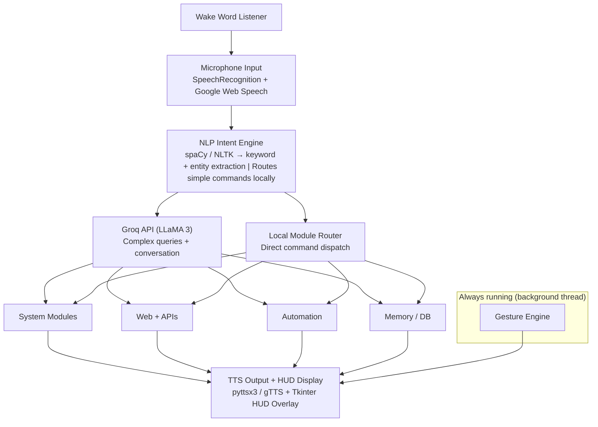
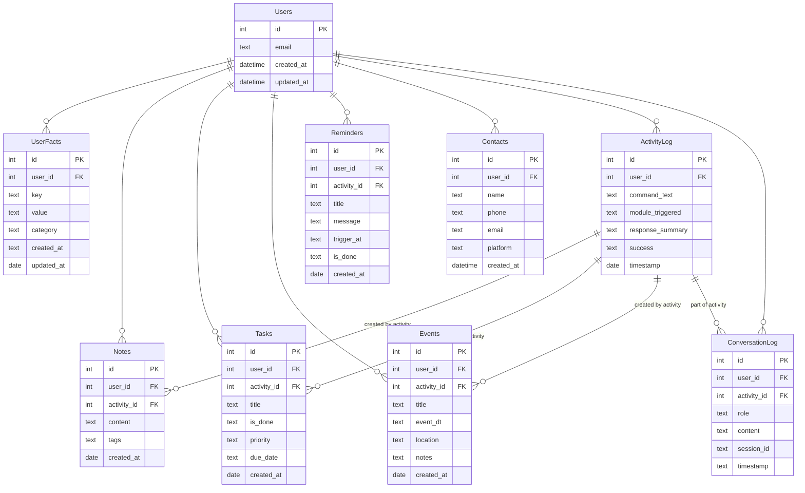

## System Architecture

```mermaid
flowchart TD
    subgraph BG["Always running (background thread)"]
        GE["Gesture Engine"]
    end

    WW["Wake Word Listener"]
    WW --> MIC
    MIC["Microphone Input\nSpeechRecognition + Google Web Speech"]
    MIC --> NLP
    NLP["NLP Intent Engine\nspaCy / NLTK → keyword + entity extraction | Routes simple commands locally"]
    NLP --> GROQ
    NLP --> LMR
    GROQ["Groq API (LLaMA 3)\nComplex queries + conversation"]
    LMR["Local Module Router\nDirect command dispatch"]
    GROQ --> SYS
    GROQ --> WEB
    GROQ --> AUTO
    GROQ --> MEM
    LMR --> SYS
    LMR --> WEB
    LMR --> AUTO
    LMR --> MEM
    SYS["System Modules"]
    WEB["Web + APIs"]
    AUTO["Automation"]
    MEM["Memory / DB"]
    SYS --> TTS
    WEB --> TTS
    AUTO --> TTS
    MEM --> TTS
    GE --> TTS
    TTS["TTS Output + HUD Display\npyttsx3 / gTTS + Tkinter HUD Overlay"]
```

## Database Schema

```mermaid
erDiagram
    Users {
        int id PK
        text email
        datetime created_at
        datetime updated_at
    }
    UserFacts {
        int id PK
        int user_id FK
        text key
        text value
        text category
        text created_at
        date updated_at
    }
    Notes {
        int id PK
        int user_id FK
        int activity_id FK
        text content
        text tags
        date created_at
    }
    Tasks {
        int id PK
        int user_id FK
        int activity_id FK
        text title
        text is_done
        text priority
        text due_date
        date created_at
    }
    Events {
        int id PK
        int user_id FK
        int activity_id FK
        text title
        text event_dt
        text location
        text notes
        date created_at
    }
    Reminders {
        int id PK
        int user_id FK
        int activity_id FK
        text title
        text message
        text trigger_at
        text is_done
        date created_at
    }
    Contacts {
        int id PK
        int user_id FK
        text name
        text phone
        text email
        text platform
        datetime created_at
    }
    ActivityLog {
        int id PK
        int user_id FK
        text command_text
        text module_triggered
        text response_summary
        text success
        date timestamp
    }
    ConversationLog {
        int id PK
        int user_id FK
        int activity_id FK
        text role
        text content
        text session_id
        text timestamp
    }
    Users ||--o{ UserFacts : ""
    Users ||--o{ Notes : ""
    Users ||--o{ Tasks : ""
    Users ||--o{ Events : ""
    Users ||--o{ Reminders : ""
    Users ||--o{ Contacts : ""
    Users ||--o{ ActivityLog : ""
    Users ||--o{ ConversationLog : ""
    ActivityLog ||--o{ Notes : "created by activity"
    ActivityLog ||--o{ Tasks : "created by activity"
    ActivityLog ||--o{ Events : "created by activity"
    ActivityLog ||--o{ ConversationLog : "part of activity"
```