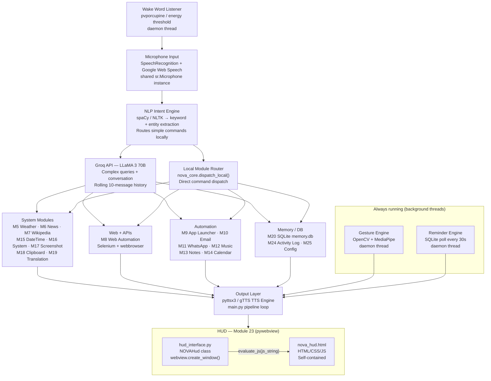
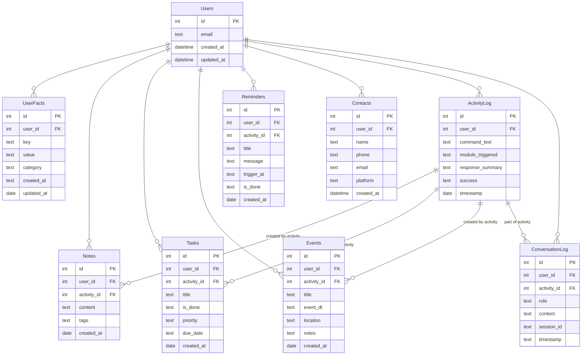

## System Architecture



### Communication Model — Python → HUD

All HUD updates flow exclusively through `main.py`'s pipeline loop via three methods on the `NOVAHud` instance:

| Python call                      | JS function invoked                  | Effect                                       |
| -------------------------------- | ------------------------------------ | -------------------------------------------- |
| `hud.update_status("listening")` | `window.novaSetStatus('listening')`  | Dot colour, label, waveform amplitude/colour |
| `hud.log_message("user", text)`  | `window.novaAppendLog('user', text)` | Append command row to log panel              |
| `hud.log_message("nova", text)`  | `window.novaAppendLog('nova', text)` | Append response row to log panel             |
| `hud.update_ticker(text)`        | `window.novaSetTicker(text)`         | Update scrolling reminders ticker            |

`evaluate_js()` is thread-safe in pywebview 4.x+. Calls made before the DOM is ready are buffered in an internal `queue.Queue` and flushed once `window.events.loaded` fires.

No module other than `main.py` should call HUD methods directly.

---

## Thread Architecture

| Thread                  | Type   | Owns                                     | Communicates via                                       |
| ----------------------- | ------ | ---------------------------------------- | ------------------------------------------------------ |
| `main`                  | Main   | pywebview event loop (`webview.start()`) | —                                                      |
| `voice_pipeline_thread` | Daemon | STT → NLP → route → TTS → HUD            | Calls `hud.*` methods directly; uses `wake_event`      |
| `wake_word_thread`      | Daemon | pvporcupine / energy scan                | `threading.Event` (wake_event)                         |
| `gesture_thread`        | Daemon | OpenCV + MediaPipe                       | `queue.Queue` (gesture_queue)                          |
| `reminder_thread`       | Daemon | SQLite reminder poll                     | `queue.Queue` (reminder_queue) → `hud.update_ticker()` |

> **Note:** In Day 6 the main thread was owned by Tkinter's mainloop. After Day 11(B) the main thread is owned by `webview.start()`. The voice pipeline moved to a daemon thread. This is the current architecture.

---

## Folder Structure (current)

```
nova-ai/
├── main.py                     # Entry point — threads, TTS, pipeline loop
├── nova_core.py                # Central router — route() + dispatch_local()
├── .env                        # Secrets (git-ignored)
├── .env.example
├── config.json                 # Master config (hot-reload)
├── requirements.txt
│
├── modules/
│   ├── __init__.py
│   ├── hud_interface.py        # M23 — NOVAHud (pywebview)  ← UPDATED Day 11(B)
│   ├── nova_hud.html           # M23 — Cinematic HTML/CSS/JS HUD ← NEW Day 11(B)
│   ├── wake_word.py            # M1
│   ├── stt.py                  # M2
│   ├── nlp_engine.py           # M3
│   ├── groq_brain.py           # M4
│   ├── weather.py              # M5
│   ├── news.py                 # M6
│   ├── wikipedia_module.py     # M7
│   ├── web_automation.py       # M8
│   ├── app_launcher.py         # M9
│   ├── email_module.py         # M10  ← Day 12 next
│   ├── whatsapp_module.py      # M11
│   ├── music_module.py         # M12
│   ├── notes_reminders.py      # M13
│   ├── calendar_tasks.py       # M14
│   ├── datetime_calc.py        # M15
│   ├── system_controls.py      # M16
│   ├── screenshot_tools.py     # M17
│   ├── clipboard_manager.py    # M18
│   ├── translation_module.py   # M19
│   ├── memory_system.py        # M20
│   ├── personality.py          # M21
│   ├── gesture_engine.py       # M22
│   ├── activity_log.py         # M24
│   └── config_manager.py       # M25
│
├── config/
│   ├── apps.json
│   ├── sites.json
│   └── contacts.json
│
├── data/
│   ├── memory.db               # Created at runtime
│   └── activity_log.db         # Created at runtime
│
├── assets/
│   └── logo/                   # SVG logo variants (static reference)
│
└── tests/
    └── test_all.py
```

> `nova_hud.html` lives inside `modules/` alongside `hud_interface.py`. The `NOVAHud` class resolves its path relative to `__file__` so it works regardless of the working directory `main.py` is launched from.

---

## Database Schema


